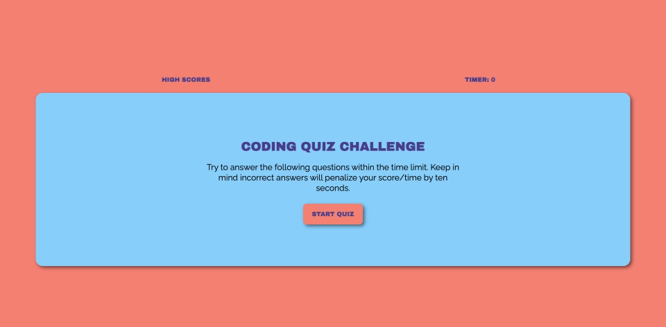
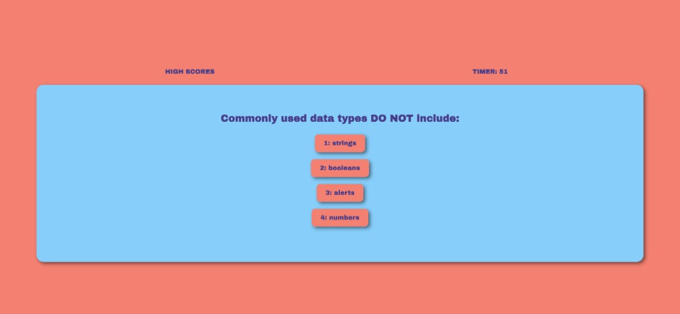

# Web-APIs-Code-Quiz

## Description
A timed coding quiz with multiple-choice questions built using dynamically-updated HTML, CSS, JavaScript

## Links

[**Week Four Challenge**](https://mbartnett.github.io/Web-APIs-Code-Quiz/) 
[**Week Four Challenge Repo**](https://github.com/mbartnett/Web-APIs-Code-Quiz)

## Screengrabs

## License

Please refer to the LICENSE in the repo.
